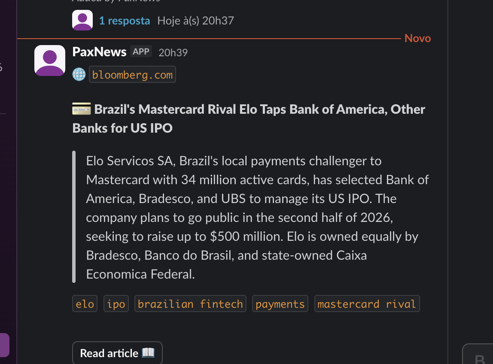

# news-to-slack

A Chrome extension + Cloudflare Worker that lets you right-click any web page,
summarise it with Claude, and post a curated card to a Slack channel. Inspired
by internal "news bots" like CapyNews.

 

## What you get



A Slack post like this for every article you send:

- A small chip with the publication name (e.g. `🌐 valor`)
- A thematic emoji on the title (🦄 startups, 📈 growth, 🤖 AI, 🚓 public safety, …)
- A single-paragraph summary (~40–70 words) in a blockquote
- A line of tags
- A `Read article 📖` button
- A **thread reply** with 5–8 detailed bullets for readers who want depth
- Auto language detection (Portuguese articles → Portuguese summary, English → English, etc.)

## How it works

```
[Chrome extension] --right click--> [extract page] --POST /api/analyze--> [Cloudflare Worker]
                                                                                  |
                                                                          summarise with Claude
                                                                                  |
                                                                          post to Slack channel
```

- **Extension** (`extension/`): MV3 Chrome extension. Adds a context-menu entry,
  extracts page content with Readability, sends it to the Worker.
- **Worker** (`worker/`): Cloudflare Worker that authenticates users by emailing
  a PIN to their Slack DM, issues a JWT, calls the Anthropic API, and posts to
  Slack via Block Kit.
- **KV namespace**: stores PINs (10-min TTL) and rate-limit counters.

## Setup

### 0. Prerequisites

- Node.js 18+ (`brew install node` on macOS)
- A Cloudflare account (free tier is fine)
- An Anthropic API key (https://console.anthropic.com/)
- A Slack workspace where you can install a custom app

### 1. Create the Slack app

1. Go to https://api.slack.com/apps → **Create New App** → From scratch.
2. Name it whatever (e.g. "NewsBot"), pick your workspace.
3. **OAuth & Permissions** → add these Bot Token Scopes:
   - `chat:write` (post to channels)
   - `chat:write.public` (post without being invited — optional)
   - `im:write` (DM users — needed for the PIN flow)
   - `users:read.email` (look up users by email)
4. **Install to Workspace** → copy the **Bot User OAuth Token** (`xoxb-...`).
5. Invite the bot to the target channel: `/invite @YourBotName` inside the channel.
6. Right-click the channel → **View channel details** → scroll to the bottom to copy the **Channel ID** (looks like `C0XXXXXXXXX`).

### 2. Configure & deploy the Worker

```bash
cd worker
cp wrangler.toml.example wrangler.toml
```

Edit `wrangler.toml` and fill in:
- `account_id` — your Cloudflare account id (dashboard sidebar)
- `ALLOWED_EMAIL_DOMAIN` — e.g. `@yourcompany.com`
- `SLACK_NEWS_CHANNEL` — the channel id from step 1.6

Create a KV namespace and paste its id back into `wrangler.toml`:

```bash
npx wrangler login
npx wrangler kv namespace create NEWS_KV
# copy the id it prints into the [[kv_namespaces]] block
```

Set the three secrets:

```bash
npx wrangler secret put SLACK_BOT_TOKEN      # paste the xoxb-... from step 1.4
npx wrangler secret put ANTHROPIC_API_KEY    # from console.anthropic.com
npx wrangler secret put JWT_SECRET           # any long random string, e.g. `openssl rand -hex 32`
```

Deploy:

```bash
npx wrangler deploy
```

Copy the URL it prints (e.g. `https://news-to-slack.<you>.workers.dev`).

Sanity check:

```bash
curl https://news-to-slack.<you>.workers.dev/healthz
# → {"ok":true}
```

### 3. Configure & load the Chrome extension

```bash
cd ../extension
cp config.example.js config.js
```

Edit `config.js`:
- `WORKER_URL` — the URL from `wrangler deploy`
- `ALLOWED_EMAIL_DOMAIN` — same as in `wrangler.toml`

Load it in Chrome:
1. Open `chrome://extensions`
2. Enable **Developer mode** (top-right)
3. Click **Load unpacked** and select the `extension/` folder
4. Pin the extension to your toolbar

### 4. First-time login

1. Click the extension icon.
2. Enter your email (must match `ALLOWED_EMAIL_DOMAIN`, must exist in Slack).
3. Click **Request PIN** — a 6-digit code arrives as a DM from your bot.
4. Paste it, click **Verify**.

### 5. Use it

1. Visit any article.
2. Right-click → **Send page to PaxNews 📰**.
3. The overlay shows progress (extract → claude → slack).
4. The card lands in your channel.

## Customising

- **Bot name / extension name**: edit `extension/manifest.json` (`name`, `description`) and rebrand the context-menu label in `extension/background.js`.
- **Slack card layout**: in `worker/src/index.js`, see `postToSlack()` — it builds the Block Kit payload.
- **Summary style**: in `worker/src/index.js`, see `summariseWithClaude()` — the `system` prompt controls voice, length, emoji mapping, and tag style.
- **Multiple channels**: replace `env.SLACK_NEWS_CHANNEL` with a routing function (e.g. choose channel based on a tag returned by Claude).
- **Different LLM provider**: replace the body of `summariseWithClaude()` — keep the return shape `{ emoji, title, summary, tags, bullets }`.

## Security notes

- The Worker only accepts requests with a valid JWT (issued after PIN verification).
- PINs expire after 10 minutes and are one-shot.
- Rate-limit: 5 PIN requests/email/hour, 20 analyses/user/minute.
- Email gating: only addresses ending in `ALLOWED_EMAIL_DOMAIN` can request a PIN.
- All secrets live in Wrangler secrets (encrypted, never returned by the API). Don't commit `wrangler.toml` after filling it in — `.gitignore` already blocks it.

## License

MIT — see [LICENSE](LICENSE).
